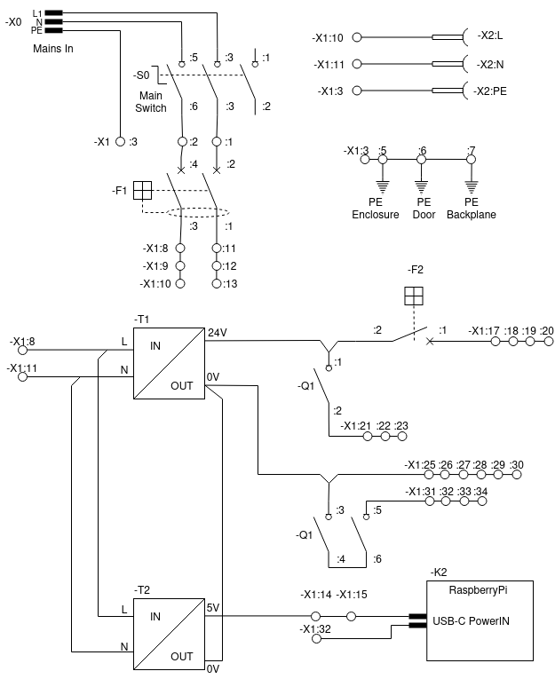
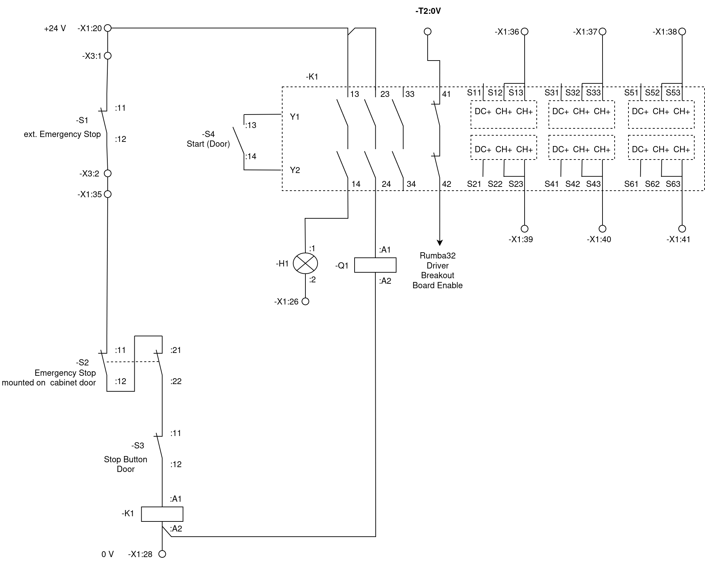

# Schematics and Terminal Plans

<!-- TOC -->

- [Schematics](#schematics)
  - [Power Distribution](#power-distribution)
  - [EmergencyStop](#emergencystop)
    - [Required Specs](#required-specs)
  - [Rumba32 and Motors](#rumba32-and-motors)
    - [NEMA color codes](#nema-color-codes)
  - [RaspberryPi](#raspberrypi)
- [Terminal Plans](#terminal-plans)
  - [X0](#x0)
  - [X1](#x1)
  - [X2](#x2)
  - [X3](#x3)
  - [X4](#x4)
  - [X5](#x5)
  - [X6](#x6)
  - [X7](#x7)
  - [X8](#x8)

<!-- /TOC -->

## Schematics

### Power Distribution

The contactor $-Q1$ disconnects the motor drivers from the power supply in case of safe-torque-off (aka emergency stop). Schneider Electric has defined this way of wiring in an [application note](https://ckm-content.se.com/ckmContent/sfc/servlet.shepherd/document/download/0691H000008h5vrQAA).

$-F1$ is an overcurrent protection with RCD. Depending to the electric installation of your lab and applicable regional laws it might be optional.

$-F2$ is an overcurrent protection.

### EmergencyStop

It is advisable (and most likely legal obligatory) having a safe-torque-off functionality according to EN-IS0 60204-1 so that the machine can be stopped in case of an emergency.  

### Required Specs

- Since the Rumba32 has no failsafe features (SIL-2 or above), the safe-torque-off must be implemented in dedicated hardware.
- To prevent unintended re-start of the drives, a dedicated safety-relais is used (-K1, _XPSUDN13AP_, Schneider Electric). The safety-relais is used with application function '6'. Start function is '1'.
- since there are no stepper motor drivers available with suitable enable inputs (high-active and approved to EN-ISO 60204-1), their enable-inputs can not be used for a safe-torque-off function. So a suitable contactor (DC-3 operation for $20 \ A$ at $24 \ V_{DC}$) must be used to cut-off the power supply to the motor drivers in case of an emergency. This contactor must be selected carefully and wired according to the manufacturers guidelines to ensure safe operation.
- with some bad luck a cheap stepper motor driver can get killed by disrupting the power supply during operation due to the back-EMF of the motor. So a motor driver has to be disabled by the enable pin before interrupting the power supply connection. A 5V signal is sent to the enbable pin of the breakout board if the safety relays turns of. This signal is assumed to be faster than the motors turning off because Q1 is a mechanical relay (switching off the machine by -S0 is always safe: the big $24 \ V$ power supply will slowly turn off the power and eventually take up most of the energy that might return from the drives.)
- The enable input of the motor drivers is used for disabling the drives while performing a field-measurement at an already reached location. This functionality is non safety-relevant, thus it can be implemented the easy way.

## Rumba32 and Motors

The [Rumba32](https://github.com/Aus3D/RUMBA32) is a 3D printer board. It is used for time-critical stuff e.g. generate the step and direction pulses for the stepper motor drivers.  
The Driver Breakoutboards are little custom PCBs plugged into the Rumba32, [here](../Rumba32/Driver_BreakoutBoard/README.md) is further documentation about them.

### NEMA color codes

NEMA stepper motors usually have short color-coded wires. Unfortunately, there are multiple colorschemes used. However, some widely used color schemes are in the table below:

| Function  | scheme a  | scheme b  | cable core no | motor connector contact   |
| ----      | ----      | ----      | ----          | ---                       |
| A+        | black     |red        | 1             | :5                        |
| A-        | green     |green      | 2             | :4                        |
| B+        | red       |blue       | 3             | :1                        |
| B-        | blue      |yellow     | 4             | :2                        |
| PE/Shield | -         | -         | gn-yl         | :3                        |

Since the cores of the shielded motor cables are black, they have numbers as identifiers. The $cable \ core \ no$ in the table above is referring to the printed identifier on each core of the cable.

## RaspberryPi

## Terminal Plans

## X0

Mains In Connector (IEC-60320 C13/C14)

| Contact   | connected to  |
| ----      | ----          |
| L         | -S0:3         |
| N         | -S0:5         |
| PE        | -X1:3         |

## X1
<!-- New Contacts:

Additional contacts for
- 8 Hardware limit switches
- 2 Software limit switches
- 5V for the motor enable
-->

|Contact #|Comment              |Bridged to contact |Left             |Right  |
|---------|---------------------|-------------------|-----------------|-------|
|1        | L Mains             | -                 | -F1:2           | -S0:3 |
|2        | N Mains             | -                 | -F1:4           | -S0:6 |
|3        | PE                  | PE DIN-rail       | -X1:24          | -X2:PE|
|4        | PE                  | PE DIN-rail       | -T1:PE          | -X0:PE|
|5        | PE                  | PE DIN-rail       | PE Enclosure    | -X6:3 |
|6        | PE                  | PE DIN-rail       | PE Door         | -X7:3 |
|7        | PE                  | PE DIN-rail       | PE Backplane    | -X8:3 |
|8        | L, fused            | 9                 | -T1:L           |       |
|9        | L, fused            | 8 + 10            | -F1:3           |       |
|10       | L, fused            | 9                 |                 | -X2:L |
|11       | N, fused            | 12                | -T1:N           | -X2:N |
|12       | N, fused            | 11 + 13           | -F1:1           |       |
|13       | N, fused            | 12                |                 |       |
|14       | 5 V                 | 15                | -T2:V+          |       |
|15       | 5 V                 | 14 + 16           | -K2:USB-V+      |       |
|16       | 5 V                 | 14                |                 |       |
|17       | 24 V                | 18                | -F2:1           |       |
|18       | 24 V                | 17 + 19           |                 |       |
|19       | 24 V                | 18 + 20           | -K3:+           | -X4:6 |
|20       | 24 V                | 19                | -K1:13          | -X3:1 |
|21       | 24 V switched       | 22                | -T3:DC+         | -Q1:2 |
|22       | 24 V switched       | 21 + 23           | -T4:DC+         | -Q1:2 |
|23       | 24 V switched       | 22                | -T5:DC+         |       |
|24       | 0 V / PE            | 25                | -X1:3           |       |
|25       | 0 V                 | 24 + 26           | -T1:-V          | -X4:5 |
|26       | 0 V                 | 25 + 27           | -H1:2           |       |
|27       | 0 V                 | 26 + 28           | -T2:-           |       |
|28       | 0 V                 | 27 + 29           | -K1:A2          |       |
|29       | 0 V                 | 28 + 30           | -K2:USB-GND     |       |
|30       | 0 V                 | 29                | -K3:-           | -X5:5 |
|31       | 0 V switched        | 32                | -T3: DC-        | -Q1:L3|
|32       | 0 V switched        | 31 + 33           | -T4:DC-         | -Q1:L3|
|33       | 0 V switched        | 32 + 34           | -T5:DC-         |       |
|34       | 0 V switched        |                   | -T6:DC-         |       |
|35       | ext. Emergency-Stop |                   | -S2:11          | -X3:2 |
|36       | Z+(Hardware)        | -                 | -K1:S13         | -X4:1 |
|37       | Z-(Hardware)        | -                 | -K1:S33         | -X4:2 |
|38       | Y+(Hardware)        | -                 | -K1:S53         | -X4:3 |
|39       | Y-(Hardware)        | -                 | -K1:S23         | -X4:4 |
|40       | X+(Hardware)        | -                 | -K1:S43         | -X4:7 |
|41       | X-(Hardware)        | -                 | -K1:S63         | -X4:8 |
|42       | Z+(Software)        | -                 | -K3:Z+          | -X5:1 |
|43       | Z-(Software)        | -                 | -K3:Z-          | -X5:2 |
|44       | Y+(Software)        | -                 | -K3:Y+          | -X5:3 |
|45       | Y-(Software)        | -                 | -K3:Y-          | -X5:4 |
|46       | X+(Software)        | -                 | -K3:X+          | -X5:7 |
|47       | X-(Software)        | -                 | -K3:X-          | -X5:8 |
|48       | 12 V Endstop        |                   | -K3:12V Endstops| -X5:6 |
|49       | -M1:A+              |                   | -T3:A+          | -X6:5 |
|50       | -M1:A-              |                   | -T3:A-          | -X6:4 |
|51       | -M1:B+              |                   | -T3:B+          | -X6:1 |
|52       | -M1:B-              |                   | -T3:B-          | -X6:2 |
|53       | -M2:A+              |                   | -T4:A+          | -X7:5 |
|54       | -M2:A-              |                   | -T4:A-          | -X7:4 |
|55       | -M2:B+              |                   | -T4:B+          | -X7:1 |
|56       | -M2:B-              |                   | -T4:B-          | -X7:2 |
|57       | -M3:A+              |                   | -T5:A+          | -X8:5 |
|58       | -M3:A-              |                   | -T5:A-          | -X8:4 |
|59       | -M3:B+              |                   | -T5:B+          | -X8:1 |
|60       | -M3:B-              |                   | -T5:B-          | -X8:2 |
|61       |                     |                   |                 |       |
|62       |                     |                   |                 |       |
|63       |                     |                   |                 |       |
|64       |                     |                   |                 |       |
|65       |                     |                   |                 |       |
|66       |                     |                   |                 |       |
|67       |                     |                   |                 |       |
|68       |                     |                   |                 |       |
|69       |                     |                   |                 |       |
|70       |                     |                   |                 |       |

The contacts 61 to 70 are reserved for future upgrades, e.g. additional axis.

## X2

External Power Socket

| Contact   | connected to  |
| ----      | ----          |
| L         | -X1:10        |
| N         | -X1:11        |
| PE        | -X1:7         |

## X3

External Emergency Stop Connector

| Contact | Comment     | Connected To |
|---------|-------------|--------------|
| 1       | +24 V       | -X1:19       |
| 2       | Switch Out  | -X1:35       |
| 3       | -           | -            |

## X4

Hardware Endstops Connector 10 pin

| Contact | Comment    | Connected To |
|---------|------------|--------------|
| 1       | Z+         | -X1:35       |
| 2       | Z-         | -X1:36       |
| 3       | Y+         | -X1:38       |
| 4       | Y-         | -X1:39       |
| 5       | 0 V        | -X1:24       |
| 6       | 24V        | -X1:18       |
| 7       | X+         | -X1:40       |
| 8       | X-         | -X1:41       |
| 9       | -          | -            |
| 10      | -          | -            |

## X5

Software Endstops Connector 10 PIN

| Contact | Comment | Connected To |
|---------|---------|--------------|
| 1       | Z+      | -X1:42       |
| 2       | Z-      | -X1:43       |
| 3       | Y+      | -X1:44       |
| 4       | Y-      | -X1:45       |
| 5       | 0V      | -X1:29       |
| 6       | 12 V    | -X1:37       |
| 7       | X+      | -X1:46       |
| 8       | X-      | -X1:47       |
| 9       | -       | -            |
| 10      | -       | -            |

## X6

Motor X-Axis Connector (GX20 5-pin)

| Contact | Comment     | Connected To |
|---------|-------------|--------------|
| 1       | B+          | -X1:50       |
| 2       | B-          | -X1:51       |
| 3       | PE & Shield | -X1:5        |
| 4       | A-          | -X1:49       |
| 5       | A+          | -X1:48       |

## X7

Motor Y-Axis Connector (GX20 Shieled 5-pin)

| Contact | Comment     | Connected To |
|---------|-------------|--------------|
| 1       | B+          | -X1:54       |
| 2       | B-          | -X1:55       |
| 3       | PE & Shield | -X1:6        |
| 4       | A-          | -X1:53       |
| 5       | A+          | -X1:52       |

## X8

Motor Z-Axis Connector (GX20 Shielded 5 pin)

| Contact | Comment     | Connected To |
|---------|-------------|--------------|
| 1       | B+          | -X1:58       |
| 2       | B-          | -X1:59       |
| 3       | PE & Shield | -X1:7        |
| 4       | A-          | -X1:57       |
| 5       | A+          | -X1:56       |
