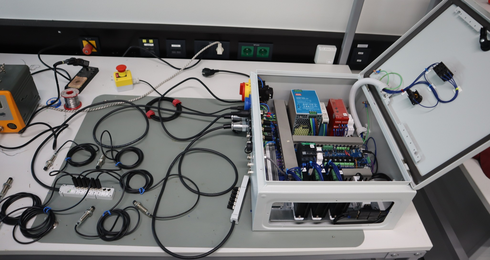

# Commissioning

This section contains the steps to commission the COSI measure. This includes the steps to ensure that the machine is properly assembled and ready for use.

## 1. Setup

Do the following steps to commission the machine:

1. Connect the machine to the enclosure.
2. Unplug the USB power supply of the RaspberryPi!
3. Ensure/ measure that the PE is correct
4. Connect to mains
5. Ensure and test that all safety related things are working properly, e.g. that the safe-torque-off (emergency stop) is working correct. In case you have hardware limit switches you need them connected for testing.

---
Figure: Testing of the hardware limit switches. As soon as one of the limit switches is triggered the safety relay should turn off.

## 2. Set the DIP-switches of the motor drivers:

For T3:

| Switch # | Comment           | Switch Position |
|----------|-------------------|-----------------|
| SW1      | Current Setting   | ON              |
| SW2      | Current Setting   | ON              |
| SW3      | Current Setting   | OFF             |
| SW4      | Halt Current      | OFF             |
| SW5      | Microstep Setting | ON              |
| SW6      | Microstep Setting | OFF             |
| SW7      | Microstep Setting | OFF             |
| SW8      | Microstep Setting | ON              |

For T4:

| Switch # | Comment           | Switch Position |
|----------|-------------------|-----------------|
| SW1      | Current Setting   | ON              |
| SW2      | Current Setting   | ON              |
| SW3      | Current Setting   | OFF             |
| SW4      | Halt Current      | OFF             |
| SW5      | Microstep Setting | ON              |
| SW6      | Microstep Setting | OFF             |
| SW7      | Microstep Setting | OFF             |
| SW8      | Microstep Setting | ON              |

For T5:

| Switch # | Comment           | Switch Position |
|----------|-------------------|-----------------|
| SW1      | Current Setting   | OFF             |
| SW2      | Current Setting   | OFF             |
| SW3      | Current Setting   | ON              |
| SW4      | Halt Current      | OFF             |
| SW5      | Microstep Setting | ON              |
| SW6      | Microstep Setting | OFF             |
| SW7      | Microstep Setting | OFF             |
| SW8      | Microstep Setting | ON              |

You can later tune the [microstepping](https://www.analog.com/en/lp/001/optimizing-stepper-motors-microstepping.html) and the motor currents to your setup. The table above might be a good starting point.  Keep in mind: If you change the microstep settings on the motor drivers, you also need to change it in the [printer.cfg](../src/software/printer.cfg)-file. 

A higher microstep setting reduces the holding torque which can be compensated by more current. Having too much microsteps per full step with not enough current leads to less precise movement and increased oscillation. More info on that: <https://www.monolithicpower.com/why-microstepping-isnt-as-good-as-you-think>

## 3. Turn off the main switch

Now wait until the 5V powersupply is discharged and then put back the USB power supply to RaspberryPi. Now you are ready to start with the [software](../Software/README.md).
