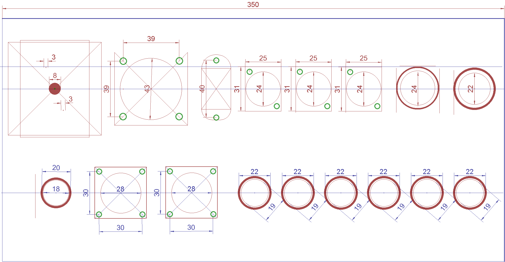
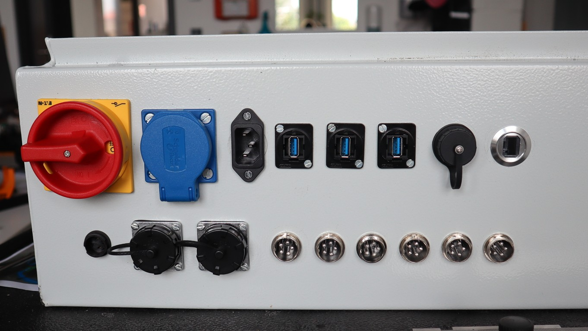
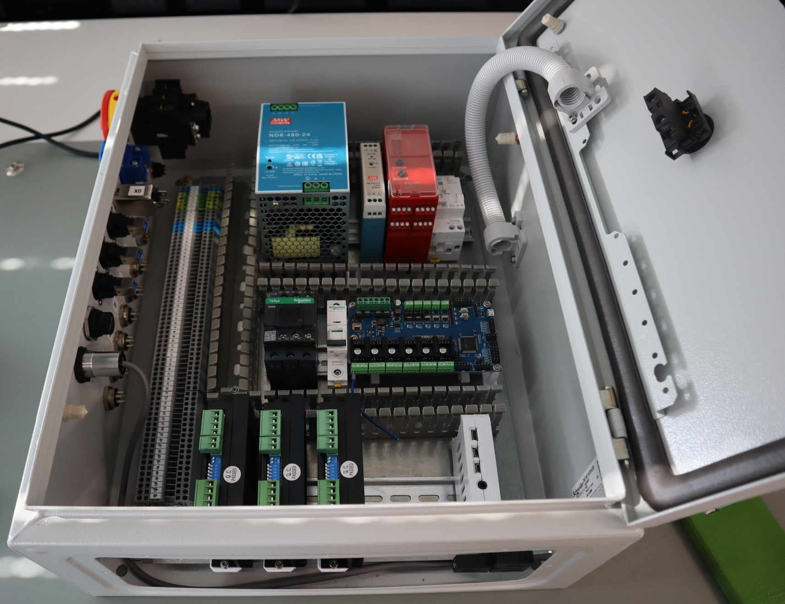
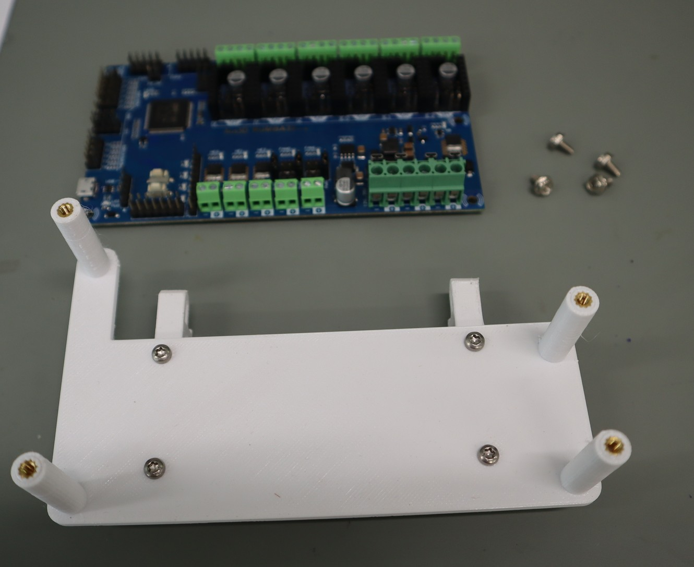
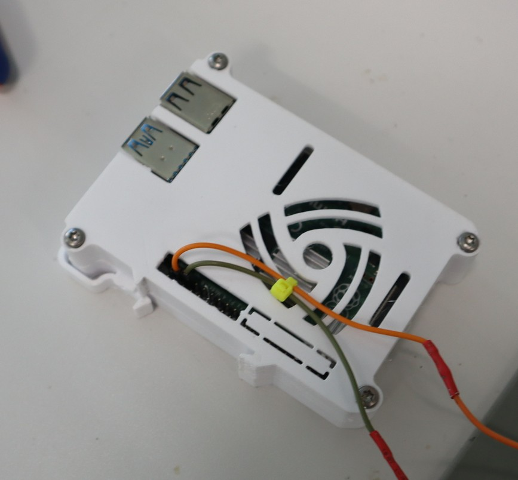
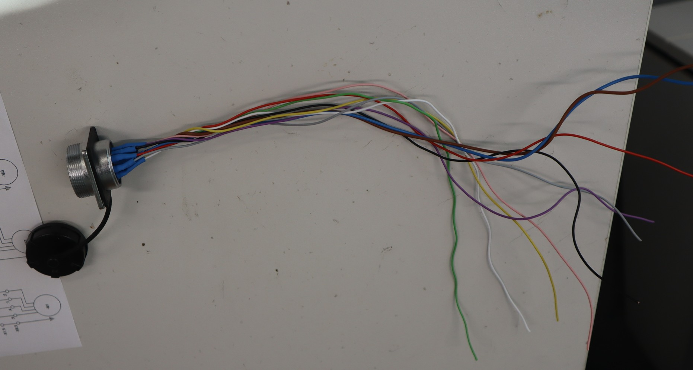
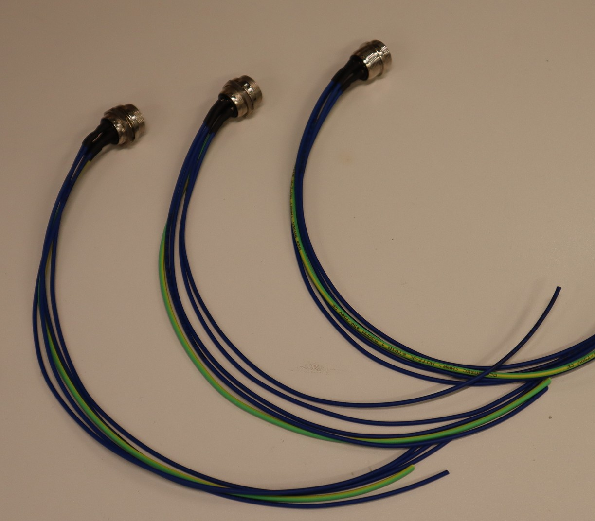
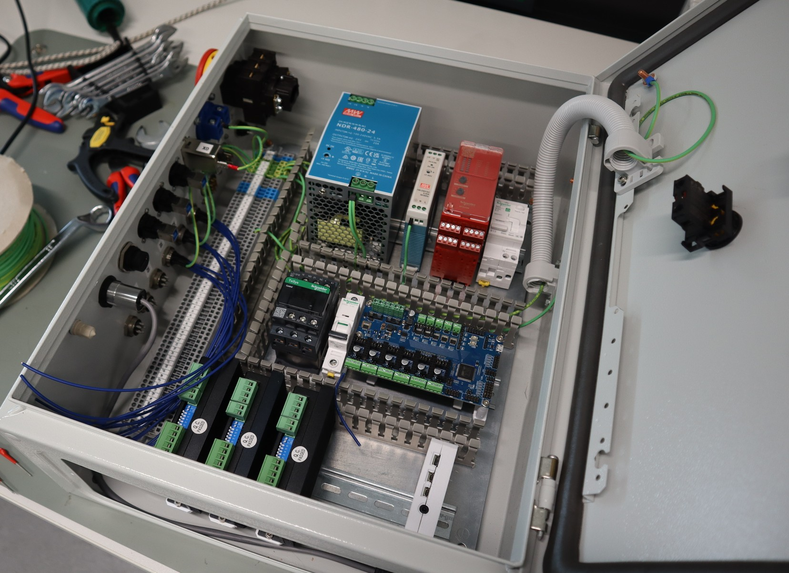
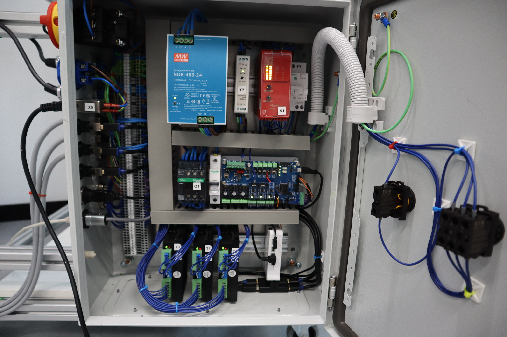

# COSI Measure Electronic Controls

In this folder are all the files you need to rebuild the electronic cabinet of COSI Measure. In every subfolder is a README.md as a landing page with detailed information on every subsystem.

## Building Instructions

### 1. Buy all needed components

Buy all needed components - see [bom-electronic-cabinet._v2.1.md](../src/enclosure/bom-electronic-cabinet_v2.1.md).

Keep in mind that there are some things missing that most of the labs have laying around e.g. screws, cables...

### 2. Machine all holes in the enclosure

This setup is for all 6 stepper motor drivers and hardware limit switches.

- If you only use 3 drivers, you can omit three of the lower 22mm holes (GX20).
- The lower 28mm holes are for the limit switch connectors. If you don't have hardware limit switches you only need one of those.
- The 8mm hole is for the main switch.
- The 43mm hole is for the 230V outlet.
- To the right of the 43mm hole is the IEC 6032 connector.
- The three 24mm holes are for USB.
- The 24mm to the right of the three USB connectors is HDMI.
- The 22mm to the far right is for the Ethernet connector.

Now drill all of the holes in the door for the:

- Emergency stop button
- ON/OFF switch

<!-- Ok this section has the following changes:

1. Everything is now mounted on DIN rails so I need to add the according 3d printed parts

-->

### 3. Mount all devices to the baseplate and the door

We riveted all of the DIN rails to the baseplate.

⚠️**Important**⚠️ Mount the cable tubing the other way around compared to the picture. This way it's not pulled down by gravity.

The following components are mounted on 3D printed adapters for DIN rails:

- Rumba32 - the STL can be found [here](...) and the clips, which you need to print twice, [here](https://github.com/VoronDesign/Voron-0/blob/d8425f9a4c25db30f294dca77d6cb5cbd6e59c82/STLs/Electronics/PCB_DIN_Clip_x2.stl). You need to assemble the Rumba32 DIN rail mount but it's probably a good idea to first perform the modifications on the Rumba board described in the [Rumba32](rumba32/README.md) section.

- Raspberry Pi - the STL can be found on [thingiverse](https://www.thingiverse.com/thing:3849108).

Figure: DIN rail mount for Raspberry Pi. There are some cables already added to the GPIOs which are connected to the Rumba32. Look at the schematics for more details.

- DMT542 stepper motor drivers - find the STL files on [printables](https://www.printables.com/model/323993-din-rail-dm542-dm556-cnc-stepper-driver-mount-with)

Play around with the scaling a little bit when printing in order to achieve a good fit.

Note: In case you ordered the enclosure from the BoM you probably have more space compared to the picture. Just enjoy the extra space, it makes wiring easier.

### 4. Build the [breakoutboards](rumba32/README.md)

For this see [Levelshifter](rumba32/endstop_levelshifter_assembly.md) and [Driver Breakoutboards](rumba32/driver_breakoutboard_assembly.md). Place them into the Rumba32 board.

### 5. Mount all devices to the door and the side of the enclosure

Add cables to the connectors before hand. This makes it easier to connect everything later on.

---

Figure: Endstop connector with wires added. You might have another connector for the endstops, but the principle is the same. If you have hardware endstops you need to do this twice.

---

Figure: Motor connectors with added wires.

### 6. Wire PE, see [schematics](../res/picto/enclosure_schematics/)

Use green-yellow wire for that.

---

Figure: PE wiring. The PE wire is connected to the enclosure and all devices inside the enclosure. Compare it to the schematics to see where to connect it.

⚠️**Important**⚠️ Keep the 230V connectors isolated, don't use unisolated connectors like shown in the picture!

### 7. Wire everything else, see [wiring guide](enclosure_wiring.md)

Keep in mind all applicable (local) regulations. 24 V DC is wired in dark blue. 230 V AC is wired in black (not brown like the pictures), the neutral wire is light blue. The 24 V power supply delivers 480 watts, so be aware to choose matching cable diameters.

Additionally, keep the high current motor cables away from the low voltage signal cables to avoid interference.

Figure: This is an example on how the final wiring can look like.