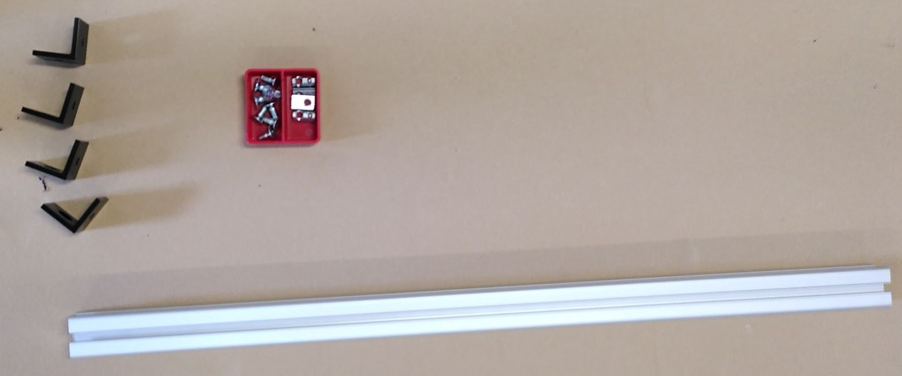

# COSI Measure Assembly

This document contains the steps to assemble the mechanical components of the COSI measure. The mechanical assembly is the first step in the assembly process. Once you have completed the mechanical assembly, you can move on to the [Enclosure Assembly](enclosure_assembly.md).

## Table of Contents

1. [Introduction](#introduction)
2. [Ordering Parts and Build Notes](#ordering-parts-and-build-notes)
3. [Assembly](#assembly)
4. [Testing](#testing)

## Introduction

We have two different assemblies to do, the mechanical assembly and the electrical assembly. The mechanical assembly is straightforward - just follow the assembly instructions.

For the electrical part some PCBs have to be manufactured and you should probably have some experience with wiring electronics.

## Ordering Parts and Build Notes

The BOM for the mechanical parts can be found [here](../src/mechanical/2024-08-03_cosi-measure_v2.0_BoM_mechanical_assembly.md). You need to manufacture some parts, like the aluminum plates, and order some parts, like the linear bearings.

Technical drawings for the aluminum plates can be found [here](../src/mechanical/Aluplates/FreeCAD/Technical%20Drawings).

The links in the BOM are still valid, so you can use them to order the parts (April-2024).

Make sure to order a few extra screws and nuts, since you don't want to be stuck in the middle of the assembly process because you are missing a screw.

The final assembly is quite large, so make sure you can still transport it to the place where you want to use it.

## Assembly

### Mechanical Assembly

#### Step 1

| Quantity | Part description              | BoM Number | Comment |
|----------|-------------------------------|------------|---------|
| 6        | Aluminum Frames (40x80x800)mm | 1          |         |
| 8        | Angles, 40x80                 | 2          |         |
| 36       | Slot nuts, M8                 | 2/4        |         |
| 32       | Screws, M8x18                 | 2          |         |

<figcaption>Figure 1: Components needed for step 1. Two aluminum profiles are missing in the picture. </figcaption>

---

1.1. Insert the _Slot nuts, M8_ into the _Aluminum Frames (40x80x800)mm_.

<figcaption>Figure 1.1: Inserted slots for two of the aluminum frames. Do this for all 6 parts.    </figcaption>

---

1.2 Add _Angles, 40x80_ to two of the _Aluminum Frames (40x80x800)mm_ using the _Screws, M8x18_ and the previously inserted _Slot nuts, M8_. I placed the _Angles, 40x80_ with the bridge facing each other to avoid forming a hard to clean cavity.

<figcaption> Figure 1.2: Aluminium frames with the the angles mounted.</figcaption>

---

1.3 Take four _Slot nuts, M8_ and insert them into the _Aluminum Frames (40x80x800)mm_ with the mounted angles. Do this on the short side, perpendicular to where you placed the slot nuts in the aluminum frames previously.

<figcaption> Figure 1.3: Slot nuts inserted into the angles. </figcaption>

---

1.4 Form a U shape with the frame with the angle mounted and two of the frames without angles. Do this twice to obtain two U shapes.

<figcaption> Figure 1.4: U shape formed with the frames. </figcaption>

---

#### Step 2

| Quantity | Part description              | BoM Number | Comment |
|----------|-------------------------------|------------|---------|
| 2        | Aluminum Frames (40x40x800)mm | 3          |         |
| 8        | Angles, 40x40                 | 4          |         |
| 12       | Slot nuts, M8                 | 4          |         |
| 16       | Screws, M8x16, countersunk    | 4          |         |

<figcaption> Figure 2: Components needed for step 2. </figcaption>

---

2.1 Add two _Slot nuts, M8_ to the _Aluminum Frames (40x40x800)mm_ in a perpendicular fashion.

<figcaption> Figure 2.1: Slot nuts inserted into the aluminum frame. Do this for both sides for both aluminum frames. </figcaption>

---

2.2 Connect the _Aluminum Frames (40x40x800)mm_ with the _Angles, 40x40_ using the _Screws, M8x16, countersunk_. Then use the _Aluminum Frames (40x40x800)mm_ with the _Angles, 40x40_ attached, to connect the U shapes from step 1.

<figcaption> Figure 2.2: Aluminum frames connected with the angles. </figcaption>

#### Step 3

| Quantity | Part description | BoM Number | Comment |
|----------|------------------|------------|---------|
| 18       | Slot nuts, M8    | 4          |         |

---

3.1 Add the _Slot nuts, M8_ to the top of the upright standing aluminum frames (inner side).

#### Step 4

| Quantity | Part description               | BoM Number | Comment |
|----------|--------------------------------|------------|---------|
| 18       | Slot nuts, M8                  | 4          |         |
| 2        | Aluminum frames, (40x80x880)mm | 5          |         |
| 8        | Angles, 40x80                  | 2          |         |
| 32       | Screws, M8x18                  | 2          |         |

<figcaption> Figure 4: Components needed for step 4. </figcaption>

---

4.1 We add the _Slot nuts, M8_ to the _Aluminum frames, (40x80x880)mm_. Four on each side on the long side. On the short (perpendicular) side we add two _Slot nuts, M8_.

4.2 Attach the _Angles, 40x80_ to the _Aluminum frames, (40x80x880)mm_ using the _Screws, M8x18_.

<figcaption> Figure 4.2: Angles attached to the aluminum frames. </figcaption>

---

4.3 Attach the _Angles, 40x80_ to the U shapes from step 2 using the _Screws, M8x18_.

<figcaption> Figure 4.3: U shapes connected to the aluminum frames. </figcaption>

---

#### Step 5

| Quantity | Part description               | BoM Number | Comment |
|----------|--------------------------------|------------|---------|
| 1        | Aluminum frame, (40x40x800)mm | 3          |         |
| 8        | Screws, M8x16, countersunk     | 4          |         |
| 4        | Slot nuts, M8                  | 4          |         |
| 4        | Angles, 40x40                  | 4          |         |

<figcaption> Figure 5: Components needed for step 5. </figcaption>

---

5.1 Add the _Slot nuts, M8_ to the _Aluminum frame, (40x40x800)mm_ similar to Figure 2.1.

5.2 Use the angles to connect the _Aluminum frame, (40x40x800)mm_ to backside of the assembled structure.

<figcaption> Figure 5.2: Aluminum frame (40x40x800)mm attached to the backside of the structure. </figcaption>

---

##### Optional Step

If you want to attach the electronics cabinet to the aluminum frame, you can add two additional _Aluminum frames, (40x40x800)mm_ to the left side of the structure. Make sure to have a distance between the two aluminum profiles that is equal to the mounting holes of the electronics cabinet.

| Quantity | Part description               | BoM Number | Comment |
|----------|--------------------------------|------------|---------|
| 8        | Slot nuts, M8                  | (optional) |         |
| 2        | Aluminum frame, (40x40x800)mm  | (optional) |         |
| 8        | Screws, M8x16, countersunk     | (optional) |         |

---

<figcaption> Figure 5.3: Aluminum frame (40x40x800)mm attached to the left side of the structure for mounting of the electronics cabinet. </figcaption>

---

You might want to loosen the upper screws of the aluminum frame to slide the aluminum profiles in.

You can also flip the structure to the side and place the electronics cabinet on th the aluminum profiles the check if the mounting holes align.

If you want the final assembly to be a little less broad, you can also add the _Aluminum frames, (40x40x800)mm_ to the inner side of the structures _Aluminum frames, (40x80x800)mm_.

---

#### Step 6

Now we will attach the plates for the y-axis motor and spindle. Note: the pictures are without the optional step.

| Quantity | Part description               | BoM Number | Comment |
|----------|--------------------------------|------------|---------|
| 10       | Slot nuts, M8                  | 5          |         |
| 1        | Aluminum plate 3               | 6          | See [Technical Drawing](../src/mechanical/Aluplates/FreeCAD/Technical%20Drawings/2018-08-02_COSImeasure_mechanical_plate3.pdf)         |
| 1        | Aluminum plate 4               | 6          | See [Technical Drawing](../src/mechanical/Aluplates/FreeCAD/Technical%20Drawings/2018-08-02_COSImeasure_mechanical_plate4.pdf)         |
| 10         | Screws, M8x20, countersunk  | 7          |         |

---

6.1 Insert the 6 _Slot nuts, M8_ into the aluminum frame on the "left back side" of the structure.

6.2 Insert the 4 _Slot nuts, M8_ into the aluminum frame on the "right side" of the structure.

---

<figcaption> Figure 6: The Slot nuts, M8 that have been added to the aluminum frames are marked in red. </figcaption>

---

6.3 Attach the _Aluminum plate 3_ to the aluminum frame on the "left back side" of the structure using the _Screws, M8x20, countersunk_.

<figcaption> Figure 6.3: Aluminum plate 3 attached to the aluminum frame. </figcaption>

---

6.4 Attach the _Aluminum plate 4_ to the aluminum frame on the "right side" of the structure using the _Screws, M8x20, countersunk_.

<figcaption> Figure 6.4: Aluminum plate 4 attached to the aluminum frame. </figcaption>

---

#### Step 7

| Quantity | Part description               | BoM Number | Comment |
|----------|--------------------------------|------------|---------|
| 24       | Slot nuts, M5                  | 8          |         |
| 2        | Supported rail, TBS20          | 9          |         |
| 24       | Screws, M5x20                  | 10         |         |
|4         | Linear bearing, TBR20UU        | 11         |         |

<figcaption> Figure 7.2: Components needed for step 7 </figcaption>

---

7.1 Insert the _Slot nuts, M5_ into top aluminum frame (24 in total).

7.2 Attach the _Supported rail, TBS20_ to the top aluminum frame using the _Screws, M5x20_. **Don't tighten the screws yet.**

7.3 Slide the _Linear bearing, TBR20UU_ into the _Supported rail, TBS20_.

<figcaption> Figure 7.3: Supported rail attached to the top aluminum frame. </figcaption>

---

#### Step 8

Now the spindle block with the motor holder will be assembled for the x and y-axis (Easy-Mechatronics System).

| Quantity | Part description               | BoM Number | Comment |
|----------|--------------------------------|------------|---------|
| 2        | Ballscrew & spindle nut block  | 12         |         |
| 2        | Fixed bearing & motor holder   | 13         |         |
| 2        | Floating bearing               | 14         |         |
| 2        | Motor coupler                  | 15         |         |

<figcaption> Figure 8: Components needed for step 8. These are only for one of the axes, so you will need all components twice. You will need some additional screws for assembly of the spindle block.</figcaption>

---

8.1 You can find assembly instructions for the assembly of the Easy-Mechatronics system block in [this video](https://invidious.private.coffee/watch?v=Gt8ER-_8GjY). The spindle block itself needs to be assembled differently in comparison to the video. Instructions for the spindle block assembly can be found [here](https://invidious.private.coffee/watch?v=TItAG3wGPzI).
The grease fitting should be on the upper side of the spindle block for one of the axes and on the lower side for the other axis. This makes sure the grease fitting is accessible after the assembly of the complete system.

<figcaption> Figure 8.1: Assembled Easy-Mechatronics System for the x and y axis. </figcaption>

---

#### Step 9

Now we will build the z-axis.

| Quantity | Part description               | BoM Number | Comment |
|----------|--------------------------------|------------|---------|
| 1        | Easy-Mechatronics System       | 16         |         |
| 1        | Aluminum plate 8               | 6          | See [Technical Drawing](../src/mechanical/Aluplates/FreeCAD/Technical%20Drawings/2018-08-02_COSImeasure_mechanical_plate8.pdf) |
| 1        | Aluminum plate 9               | 6          | See [Technical Drawing](../src/mechanical/Aluplates/FreeCAD/Technical%20Drawings/2018-08-02_COSImeasure_mechanical_plate9.pdf) |
| 12      | Screws, M6x20               | 17          |         |

---

9.1 Assemble the Easy-Mechatronics System for the z-axis just as you did for the x and y-axis. Make sure the grease fitting is accessible after the assembly of the complete system.

9.2 Attach the _Aluminum plate 8_ and _Aluminum plate 9_  to the Easy-Mechatronics System for the z-axis using the _Screws, M6x20_. Make sure you have the correct orientation: The motor holder is on the smaller _Aluminum plate 8_.

<figcaption> Figure 9.2: Assembled Easy-Mechatronics System for the z-axis. </figcaption>

---

#### Step 10

Now we will attach the x and y-axis to the structure.

| Quantity | Part description               | BoM Number | Comment |
|----------|--------------------------------|------------|---------|
| 1        | Aluminum Plate 1               | 6          | See [Technical Drawing](../src/mechanical/Aluplates/FreeCAD/Technical%20Drawings/2018-08-02_COSImeasure_mechanical_plate1_2of2.pdf)
| 16       | Screws, M6x20, countersunk    | 18         |         |
| 2        | Assembly of x and y-axis      |          | See step 8|

| 6        | Screws, M6x20                 | 17         |         |
| 2        | Screws, M6x30                 | 24         |         |
| 2        | Screw nuts, M6                | 25         |         |

---

10.1 Attach the _Aluminum Plate 1_ to four linear bearings using the _Screws, M6x20, countersunk_.

<figcaption> Figure 10.1: Aluminum Plate 1 attached to the linear bearings. </figcaption>

---

10.2 Attach the x-axis to _Aluminum Plate 1_ using the _Screws, M6x20_. Make sure to orient the motor correctly. It makes sense to have the motor on the side of the electronics cabinet. You don't need to mount the motor yet.

  
  

---

10.3 Attach the y-axis to the _Aluminum Plate 3_ using the _Screws, M6x30_ together with the _Screw nuts, M6_ (motor side). Attach the other side of the y-axis to the _Aluminum Plate 4_ using the _Screws, M6x20_.

  
  

---

#### Step 11

We now assemble the carriage for the z-axis.

| Quantity | Part description               | BoM Number | Comment |
|----------|--------------------------------|------------|---------|
| 1        | Aluminum Plate 5               | 6          | See [Technical Drawing](../src/mechanical/Aluplates/FreeCAD/Technical%20Drawings/2018-08-02_COSImeasure_mechanical_plate5.pdf) |
| 1        | Aluminum Plate 6               | 6          | See [Technical Drawing](../src/mechanical/Aluplates/FreeCAD/Technical%20Drawings/2018-08-02_COSImeasure_mechanical_plate6.pdf) |
| 1        | Aluminum Plate 7               | 6          | See [Technical Drawing](../src/mechanical/Aluplates/FreeCAD/Technical%20Drawings/2018-08-02_COSImeasure_mechanical_plate7.pdf) |
| 4       | Screws, M5x30                 | 19         |         |
| 16      | Screws, M6x20, countersunk    | 18         |         |
| 4       | Screws, M5x30, countersunk    | 24         |         |

<figcaption> Figure 11: Components needed for step 11. </figcaption>

---

11.1 Connect _Aluminum Plate 5_ to _Aluminum Plate 6_ using the _Screws, M5x30_.

11.2 Connect _Aluminum Plate 6_ to _Aluminum Plate 7_ using the _Screws, M6x30. The assembly should look like this:

<figcaption> Figure 11.2: Assembled carriage for the z-axis (plate 5, 6 and 7). </figcaption>

---

11.3 Attach the assembled carriage to the linear bearings of the z-axis Easy-Mechatronics System using the _Screws, M6x20, countersunk_. _Aluminum Plate 5_ should be pointing towards the motor holder.

<figcaption> Figure 11.3: Carriage for the z-axis attached to the linear bearings. </figcaption>

---

11.4 Fix _Aluminum Plate 6_ to the ballscrew block using the _Screws M5x20, countersunk_.

#### Step 12

Now we will add the linear rails for the x axis.

| Quantity | Part description               | BoM Number | Comment |
|----------|--------------------------------|------------|---------|
| 2        | Supported rail                 | 9          |         |
| 4        | Linear bearing                 | 11         |         |
| 12       | Screws, M5x30                  | 19         |         |
| 12       | Hexagon nuts, M5               | 21         |         |

12.1 Slide the _Linear bearing_ into the _Supported rail_ (2x top, 2x bottom).

12.2 Place one supportin rail on top of _Aluminum Plate 1_ and put all 12 screws through the holes. Now place the other supporting rail on the bottom, so that the screws go through the holes of the supporting rail. Tighten the screws with the _Hexagon nuts, M5_.

<figcaption> Figure 12.2: Linear rails attached to the x-axis. </figcaption>

---

#### Step 13

Now the z-carriage will be attached to the x-axis.

| Quantity | Part description               | BoM Number | Comment |
|----------|--------------------------------|------------|---------|
| 1        | Assembly of z-carriage         |          | See step 11 |
| 16        | Screws, M6x20     | 18         |         |
| 4        | Screws, M5x20     | 20         |         |
| 4        | Distance Plates 1mm  | 22         |      optional   |

13.1 Attach the z-carriage to the x-axis using the _Screws, M6x20_. You might need to loosen the screws of the z-carriage to slide it onto the x-axis. It might be easier to start with the two top bearings first. If there is a gap between the z-carriage and the bearings, you can use the _Distance Plates 1mm_ to fill the gap.

<figcaption> Figure 13.1: Z-carriage attached to the x-axis. A distance plate was added to the top and the bottom to fill the gap. </figcaption>

---

13.2 Attach _Aluminum Plate 5_ to the z-carriage using the _Screws, M5x20_.

<figcaption> Figure 13.2: Aluminum Plate 5 attached to the z-carriage. </figcaption>

---

#### Step 14

Now we will connect the x-axis and the y-axis.

| Quantity | Part description               | BoM Number | Comment |
|----------|--------------------------------|------------|---------|
| 1        | Aluminum Plate 2       |    6      | See [Technical Drawing](../src/mechanical/Aluplates/FreeCAD/Technical%20Drawings/2018-08-02_COSImeasure_mechanical_plate2.pdf) |
| 4       | Screws, M5x30     | 19         |         |
| 4      | Screws, M5x20     | 18         |         |
| 1 | Distance Plate 1mm | 23 | optional |

---

14.1 Attach _Aluminum Plate 2_ to the x-axis using the _Screws, M5x30_.

14.2 Attach _Aluminum Plate 2_ to the y-axis using the _Screws, M5x20_. You might need to loosen the screws of the y-axis. If there is a gap between the y-axis and the _Aluminum Plate 2_, you can use the _Distance Plate 1mm_ to fill the gap.

<figcaption> Figure 14.2: Aluminum Plate 2 attached to the y-axis. </figcaption>

---

14.3 **Important** You can now tighten the screws of the linear bearings of the y-axis (Step 7.2).

#### Finished

This concludes the basic mechanical assembly. The system should now look like this:

<figcaption> Figure 14.3: Finished mechanical assembly. You might not have the electronics cabinet mounting in case you skipped the optional step. </figcaption>

---

#### TODO

##### Motor Mounting

##### Sensor Mounting

##### Offset Plate

##### Cable Chains

##### Wheels
